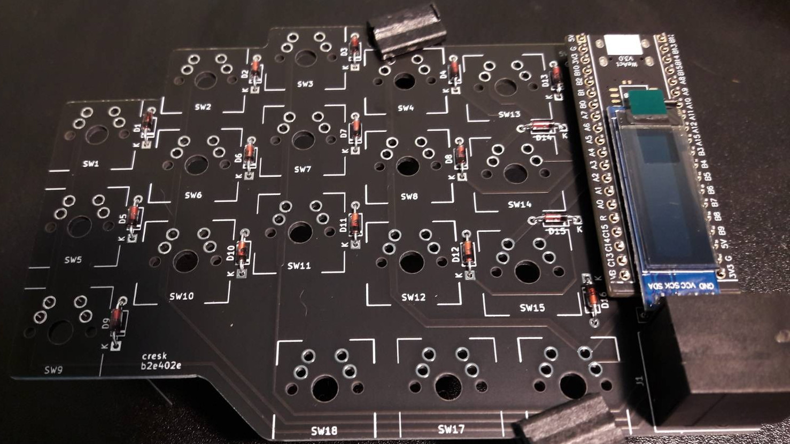
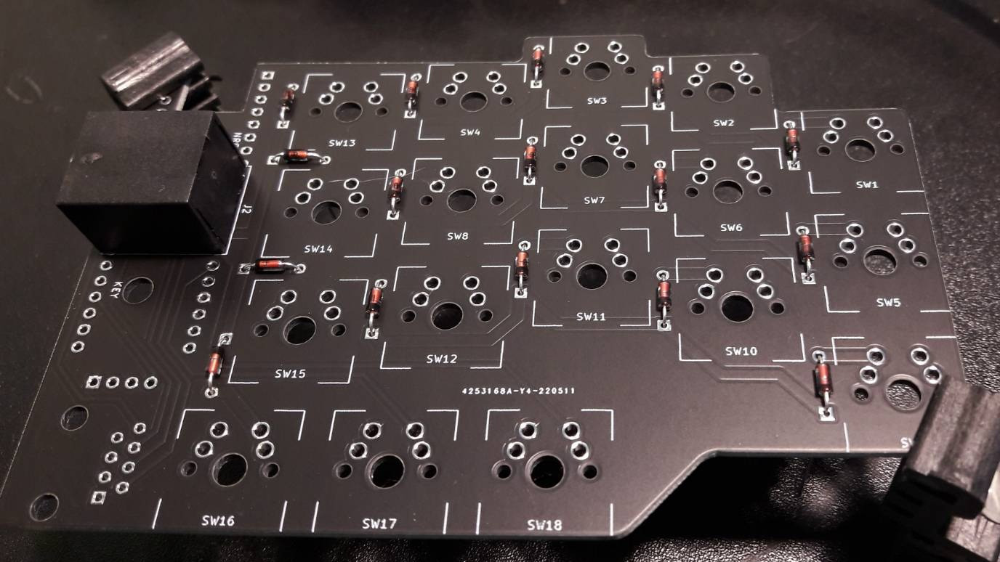
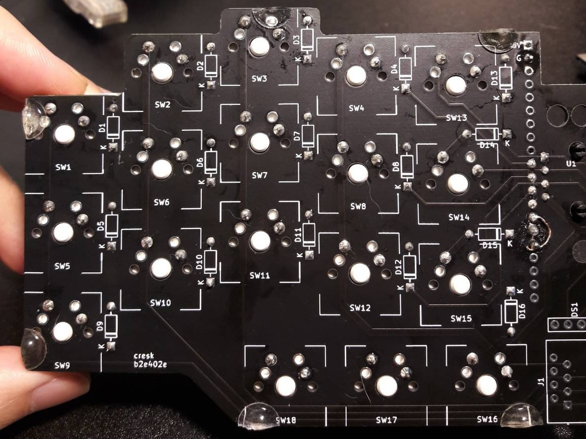
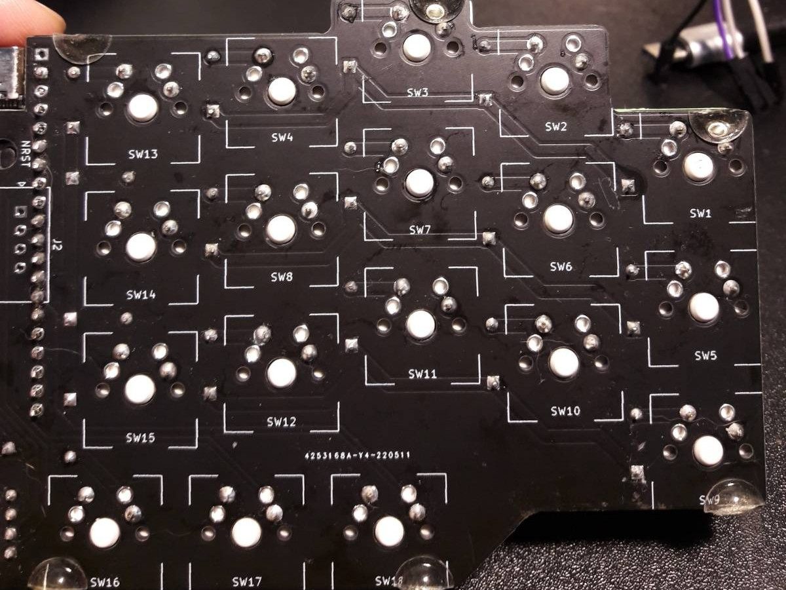
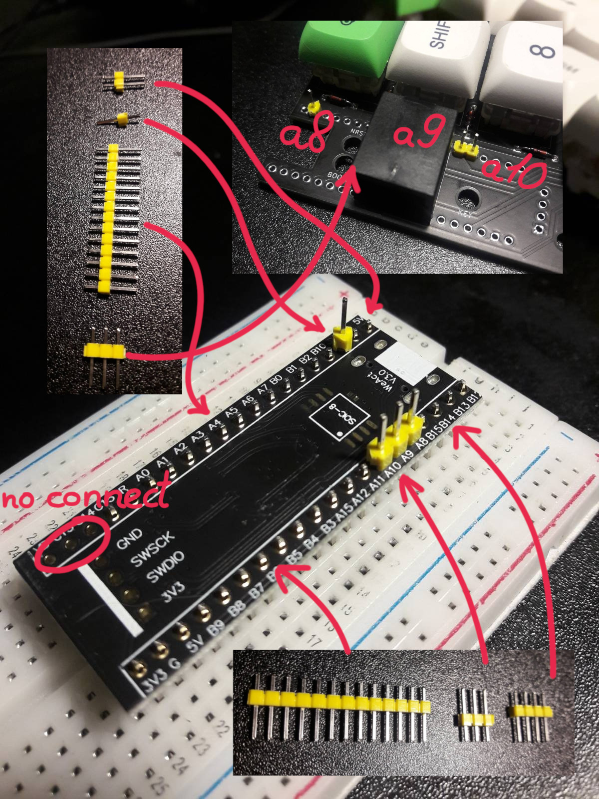
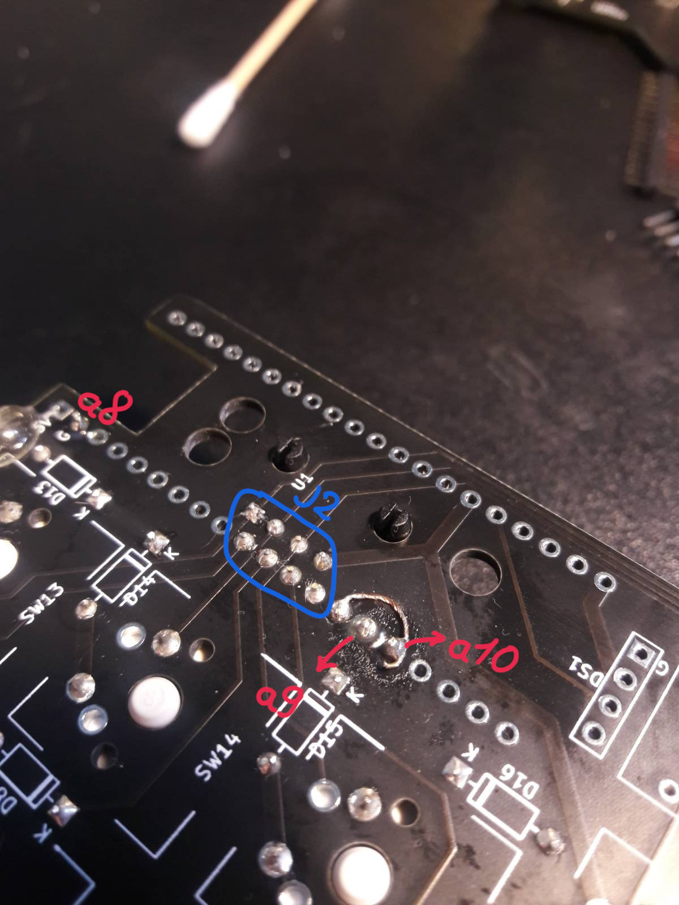

* cresk
cresk is a caseless reversible ergonomic split keyboard.
** Features
- Cheap, reversible, and minimal size PCB
- Chip-shortage friendly, only one board is needed
- 34 keys, 3x5, 18 keys on the left, and 16 keys on the other
- Absolem stagger
- ZMK firmware
- OLED display, zmk widgets, interactive bongo cat
** Parts
- PCB set
- 1x STM32F401CC BlackPill board
- 1x I2C OLED display 128x32 (optional)
- 1x USB type C cable
- 1x RJ45 cable
- 2x RJ45 connectors
- 32x Diodes 1N4148 DO-35
- 34x MX switches
- 34x Keycaps 1U
- 6x Rubber bumpers
** Bootloader
A bootloader is required since entering DFU mode on a blackpill is
nearly impossible.
*** Enter DFU bootloader
Repeat these steps until your OS recognizes the device.
- Hold BOOT0
- Press NRST
- Release BOOT0

I don't recommend entering the bootloader (or resetting) by replugging
(or powering off) the USB port as it may damage power regulator
component(s) on the blackpill. See Known issues.

You may increase the chance of success by heating it or using a USB to
TTL serial adaptor. See Known issues.
*** Flash tinyuf2 bootloader
Download [[https://github.com/adafruit/tinyuf2/releases][tinyuf2-stm32f401_blackpill-x.x.x]]
#+begin_src
dfu-util -d 0483:df11 -a 0 -s 0x08000000:leave -D tinyuf2-stm32f401_blackpill-x.x.x.bin
#+end_src
** Firmware
Firmware is either built locally or using Github Actions.
https://github.com/nguyendown/zmk-config
*** Github Actions
Fork the config repository. Customize your own keymap
~config/boards/shields/cresk/cresk.keymap~. Commit. The new firmware
will be on Actions tab.
*** Local build
https://zmk.dev/docs/development/build-flash
#+begin_src
west build -p -b blackpill_f401cc -- -DSHIELD=cresk -DZMK_CONFIG=/path/to/zmk-config/config
#+end_src
*** Flash a new firmware
Double press NRST to enter UF2 bootloader. Then copy .uf2 file to
BlackPill drive.
#+end_src
** Assemble
Components placements.

#+ATTR_HTML: :title placement1

#+ATTR_HTML: :title placement2

#+ATTR_HTML: :title bumpers1

#+ATTR_HTML: :title bumpers2

You may want to maximize repairability and extensibility by soldering
the blackpill like .

 is a more descriptive detailed instruction if you want to extend
SW17, and SW18 on the right side. Firmware for this mod:

https://github.com/nguyendown/zmk-config/tree/extend-sw17-sw18

I'll try duplex matrix in the next version.
** Known issues
*** Can't get into DFU mode
You may need to heat (or cool) it to be close to 25 degrees celsius.
See

https://forum.hobbycomponents.com/viewtopic.php?f=87&t=2947

A more reliable way is to use a USB to TTL serial adapter. Connect
the TX pin to A10 (USART1_RX) on the blackpill. It's kinda ironic that
you can just flash directly using USART.
*** Failed power component(s)
When I first received the board, I tried to get into DFU mode by
replugging the USB port instead of pressing NRST. My blackpill failed
after a few hundred tries. One or more components are probably
damaged. Maybe they were faulty in the first place. I have no idea.
Now it can't run on its own without an external 3.3v power source. I
may try an AMS1117 module later.
